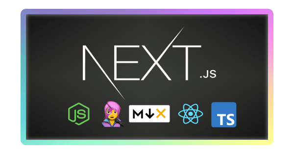

☁️ [Serverless Launch voucher](https://www.udemy.com/course/all-about-nextjs/?couponCode=SERVERLESS-LAUNCH) ☁️

# All About NextJS

This is the code for the Udemy course [All About NextJS](https://atila.io/all-about-next) by [Atila Fassina](https://atila.io/twitter)

## Roadmap

- [x] Project setup
- [x] Website app
- [x] Blog Engine
- [x] Serverless Functions and features
- [ ] CMS integration
